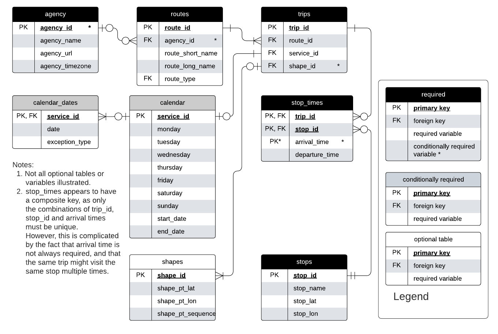
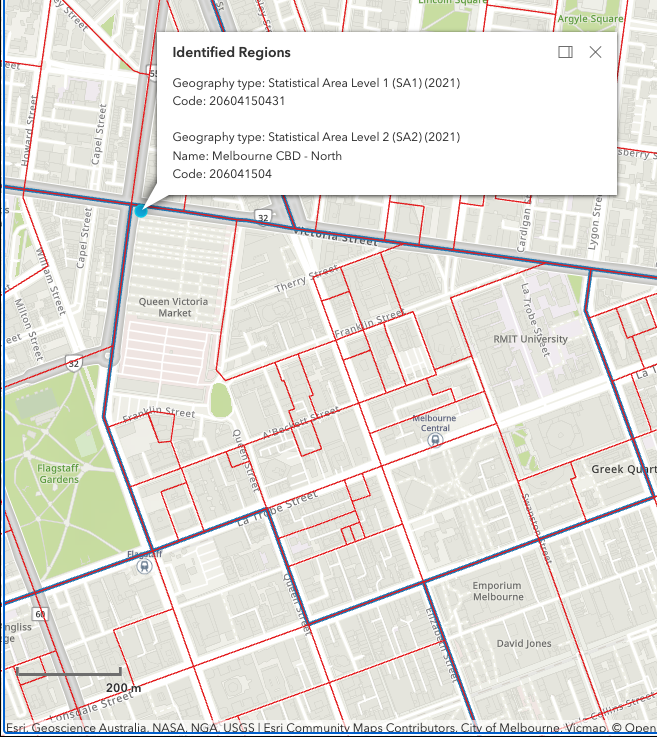

---
title: "Greater Melbourne Transit Supply Index (SI) scores for SA1 2021 boundaries"
runningheader: "Reynolds (2024)" # only for pdf output
author: "James Reynolds"
date: "`r Sys.Date()`"
output:
  tufte::tufte_html:
    citation_package: natbib
    latex_engine: xelatex
bibliography: [packages.bib, References.bib]
link-citations: yes
header-includes:
  - \usepackage{titling}
  - \pretitle{\begin{center}
    \includegraphics[width=2in,height=2in]{ptrg-logo-s.png}\LARGE\\}
  - \posttitle{\end{center}}

---

<!--- Header to produce this as a PDF Book instead
output:
  tufte::tufte_book:
    citation_package: natbib
    latex_engine: xelatex
    includes:
      in_header: "preamble.tex"
bibliography: [packages.bib, References.bib]
link-citations: yes
header-includes:
  - \usepackage{titling}
  - \pretitle{\begin{center}
    \includegraphics[width=2in,height=2in]{ptrg-logo-s.png}\LARGE\\}
  - \posttitle{\end{center}}
--->


```{r setup, include=FALSE}
library(tufte)

library(tidyverse)
library(tidytransit)
library(sp)
library(strayr)
library(ptinpoly)
library(magrittr)
library(ggplot2)
library(sf)
library(ASGS.foyer)
library(raster)
library(ggmap)
library(units)
library(janitor)
library(mapview)
library(ggstatsplot)
library(gtsummary)
library(moments)
library(scales)
library(gtfstools)
library(lubridate)
library(kableExtra)
library(knitr)
library(readxl)
library(dplyr)
library(devtools)
#remotes::install_github("James-Reynolds/gtfssupplyindex")
library(gtfssupplyindex)
# invalidate cache when the tufte version changes
#knitr::opts_chunk$set(cache.extra = packageVersion('tufte'))
```

# Introduction
Monash University's Public Transport Research Group (PTRG) is commencing a project that will make use of hourly Transit Service Index (SI) scores for Statistical Area Level 1 (SA1) 2021 census boundaries within Greater Melbourne. Code to calculate SI scores 
from GTFS datasets 
has recently been developed into
an R package. Development of that code is reported separately (see @gtfssupplyindex_github).

The next step, therefore, is to output the SI scores for Greater Melbourne and check the results.  This document describes the calculation of the SI scores for SA1 zones in Greater Melbourne for Tuesday 10th, Saturday 14th and Sunday 15th October, 2023, and reviews the results. 


The rest of this document 
is structured as follows: 
the next section discusses the research context 
of the the Supply Index. This is followed by a brief discussion of the methodology. 
In the fourth section 
results are presented, 
including SI scores for SA1s across Greater Melbourne on an hour-by-hour basis. 
Results are then discussed, 
followed by a brief conclusion 
that includes the identification of directions for future research.  


# Research context
## GTFS
The introduction of the General Transit Feed Specification (GTFS) 
and widespread release of schedule data in this format 
has helped towards making transit metrics more broadly available and useable. 
GTFS is an open, 
text-based format 
that was developed originally to allow transit information to be included in the Google Maps navigation platform [@GTFS]. 
The data structure is shown in the below figure. 

```{r GTFS_ERD, fig.width = 10, fig.height = 2, fig.fullwidth = TRUE, fig.cap = "GTFS entity relationship diagram. Source: adapted by author from Alamri et al (2023) and the GTFS Schedule Reference (16/11/2023 revision).", echo = FALSE, warning=FALSE, message=FALSE, cache=TRUE, out.width='100%'}


```

In the Entity Relationship Diargram (ERD) shown above, each box represents a database table in the GTFS, with table rows indicating the variables (columns) included in each^[For example, each record in the 'stops' table includes a value for stop_id, stop_name, stop_lat and stop_lon.]. Relationships between the tables are indicated by the connecting lines, and Primary Key (PK) and Foreign Key (FK) designations^[For example, stop_id also appears in the 'stop_times' table as a Primary Key and Foreign Key.]. "Crow's feet" indicate the relationships between each table^[See https://i.stack.imgur.com/fxaAq.png for guide to the symbols. But, for example, the stops table is required, with the stop_id field providing a unique (primary) key for every stop. Within the stop_times table (which is also required) the stop_id field is a foreign key. Each unique stop_id can appear many times in the stop_times table, but must appear only once in the stops table. In the stop_times table each combination of trip_id, stop_id and arrival time must be unique (But, see note 2!) meaning that these fields represent a composite key.].


## The Transit Suppy Index

```{marginfigure}
\begin{equation}
  SI_{area, time} = \sum{\frac{Area_{Bn}}{Area_{area}}*SL_{n, time}}
  \end{equation}
```

The Transit Supply Index (SI) was developed by @currie2007identifying. Its equation 
is shown in the margin^[
(1) $SI_{area, time}$ is the Supply Index for the area of interest 
and a given period of time;
(2) $Area_{Bn}$ is the buffer area for each stop (n) within the area of interest. 
In Currie and Senbergs (2007) this was based on 
a radius of 400 metres for bus and tram stops, 
and 800 metres for railway stations;
(3) $Area_{area}$ is the area of the area of interest; and
(4) $SL_{n,time}$ is the number of transit arrivals for each stop 
for a given time period.
Minor adjustments have been made 
to generalise the equation, 
as Currie and Senbergs (2007) focus 
was the context of Melbourne's Census Collection Districts (CCD) 
and calculations based on a week of transit service. 
CCDs predate the introduction of 
Statistical Areas 1, 2, 3, and 4 (SA1, SA2, SA3, SA4), 
and other geographical divisions 
currently used by the Australian Bureau of Statistics (ABS), 
which may be more familiar to readers.] 

An advantage of the SI is 
that it is a relatively simple number 
to calculate, 
understand 
and explain. 
It describes 
the number of transit arrivals 
at stops within 
an area of interest 
and time frame, 
multiplied by a factor 
accounting for the proportion of the area of interest that is within typical walking distance of each stop. 
Hence, 
more services, 
more stops 
and higher frequencies 
would all increase the SI score. 

Simplicity is also helped 
by the way 
that the Index is additive. 
$SI_{area, time}$ scores can be aggregated 
to calculate an overall score 
across multiple time periods 
or for a region encompassing multiple areas of interest. 

## gtfssupplyindex R package 
R [@R-base] is a widely used and readily available  statistical programming language. This was adopted for development of a package of functions and tools to calculate SI scores from a GTFS dataset. The package development setup and workflow described by @wickham2023r 
was adopted. The package is available and documented on github [@gtfssupplyindex_github]. 

The structure and functions used to generate each table are shown in the below Entity Relationship Diagram (ERD). 

```{r SI_ERD, fig.width = 10, fig.height = 2, fig.fullwidth = TRUE, fig.cap = "Entity Relationship Diagram (ERD) showing the data structure and functions of the gtfssupplyindex package", echo = FALSE, warning=FALSE, message=FALSE, cache=TRUE, out.width='100%'}
knitr::include_graphics("graphics/SI_data_structure.png")

```

The package takes input from three files: 

- a gtfs feed (gtfs.zip)
- a sf object describing the geometry of the areas for which the SI is to be calculated
- a csv file defining the buffer zone distances (in metres) for each route_type - a version of this file is included in the package. 

The ultimate goal of the functions included in the gtfssupplyindex package is to output either a si_by_area table (bottom row, second from right) or the si_by_area_and_hour table (bottom right). which reports the SI score for each hour of the day across dates specified by the user. 

Included in the package is an example GTFS dataset from the Mornington Penninsula Tourist Railway. The output (si_by_area_and_hour) table is shown as an example below.  


```{r SI_mornington_20181230_output, echo = FALSE, warning=FALSE, message=FALSE, cache=TRUE}
####-----first load all the inputs
#load the revised mornington GTFS data
list_gtfs = gtfssupplyindex:::gtfs_by_route_type(system.file(
  "extdata/mornington180109",
  "gtfs.zip", 
  package = "gtfssupplyindex", 
  mustWork = TRUE))

areas_of_interest <- load_areas_of_interest(absmapsdata::sa22021 %>% filter(sa3_name_2021 == "Mornington Peninsula") %>% select(sa2_code_2021),  area_id_field = "sa2_code_2021")

buffer_distance <- gtfssupplyindex:::load_buffer_zones()

stops_in_or_near_areas <- gtfssupplyindex:::stops_in_walk_dist(
  list_gtfs = list_gtfs, 
  areas_of_interest = areas_of_interest,
  EPSG_for_transform = 28355,
  verbose = FALSE
)

si_by_area_and_hour <- hourly(list_gtfs, stops_in_or_near_areas, "2018-12-30")

si_by_area_and_hour %>% head() %>% kable(caption = "Mornington Penninsula Tourist Railway hourly SI values for December 30, 2018, for SA1 zones, first six entries --- THIS IS WHAT THE si_by_area_and_hour TABLE LOOKS LIKE")

si_by_area_and_hour_wider <- si_by_area_and_hour %>% pivot_wider(names_from = "hour_starting", values_from = "SI") 


si_by_area_and_hour_wider %>% kable(caption = "Mornington Penninsula Tourist Railway hourly SI values for December 30, 2018, for SA1 zones, by hour --- THIS IS A 'WIDER' VERSION OF THE si_by_area_and_hour TABLE")


```

The upper table shows first six entries in the 'longer' version of the table. Each record shows the SI score for a unique combination of area_id^[Here the SA1 2021 zones] and hour_starting^[The Mornington Penninsula Railway only runs between 10am and 4pm on the day in question.]. The lower table shows the same data, but in a 'wider' format so that all hour_starting SI scores a visible^[As the Mornington Penninsula Railway has only 3 stops, only 5 SA1 2021 zones have SI scores.].  Further details of the Mornington Penninsula Railway calculations^[Including hand verification.] are available in the package documentation on github[@gtfssupplyindex_github]. 


# Methodology

In this document hourly SI scores are reported for all SA1 2021 zones within Greater Melbourne. Scores are calculated for Tuesday 10th, Saturday 14th and Sunday 15th October, 2023. These datas are selected so as to match the typical census timing of a Tuesday early in October, although 2023 is not actually a census year.  

GTFS data was obtained from @transitfeeds_victoria:2023aa, with the October 6, 2023 dataset selected.  Some minor adjustments were made to this dataset to remove duplicate stop_ids from the stops.txt file. 


```{r fix_ptv_data_Victoria_231006, eval = FALSE, echo = FALSE}
##-----THIS CHUNK ONLY NEEDS TO BE RUN ONCE TO CREATE THE gtfs_duplicate_stops_removed.zip file-----HENCE EVAL = FALSE ABOVE

ptv_231006 <- tidytransit::read_gtfs("data/ptv_231006/gtfs.zip")
# This results in "Warning: Duplicated ids found in: stops The returned object is not a tidygtfs object, you can use as_tidygtfs() after fixing the issue."

#So, remove the duplicated stops 
#identify duplicate stops
ptv_231006_duplicated_stops <- tabyl(ptv_231006$stops$stop_id) %>% filter (n>1)
names(ptv_231006_duplicated_stops) <- c("stop_id", "n", "percent")
ptv_231006_duplicated_stops <- left_join(ptv_231006_duplicated_stops, ptv_231006$stops)

##discard duplicates
ptv_231006$stops <- ptv_231006$stops[!duplicated(ptv_231006$stops$stop_id),]

## Write gtfs back to file
ptv_231006 <- as_tidygtfs(ptv_231006)
tidytransit::write_gtfs(ptv_231006, "data/ptv_231006/gtfs_duplicate_stops_removed.zip")


## convert to list of tidygtfs objects
ptv_231006_list_gtfs <- gtfssupplyindex::gtfs_by_route_type("data/ptv_231006/gtfs_duplicate_stops_removed.zip")

list_gtfs = ptv_231006_list_gtfs

areas_of_interest <- load_areas_of_interest(absmapsdata::sa12021 %>% filter(gcc_name_2021 == "Greater Melbourne") %>% select(sa1_code_2021),  area_id_field = "sa1_code_2021")

buffer_distance <- gtfssupplyindex:::load_buffer_zones()

stops_in_or_near_areas <- gtfssupplyindex:::stops_in_walk_dist(
  list_gtfs = list_gtfs, 
  areas_of_interest = areas_of_interest,
  EPSG_for_transform = 28355,
  verbose = FALSE
)

```

Hourly SI scores were obtained for all modes across all of Greater Melbourne.

```{r run_for_all_modes_Victoria_231006, eval = FALSE, echo = FALSE}

####COMMENT OUT CALCULATION AND SAVE TO FILE, SO IT DOES NOT RUN WHILE KNITTING RMARKDOWN
#si_by_area_and_hour_231010 <- hourly(
#  list_gtfs = list_gtfs, 
#  stops_in_or_near_areas = stops_in_or_near_areas, 
#  date_ymd = "2023-10-10",
#  verbose = TRUE)

#write.csv(si_by_area_and_hour_231010, "results/Greater_Melbourne/si_by_SA12021area_and_hour_231010")

####COMMENT OUT CALCULATION AND SAVE TO FILE, SO IT DOES NOT RUN WHILE KNITTING RMARKDOWN
#si_by_area_and_hour_231014 <- hourly(
#  list_gtfs = list_gtfs, 
#  stops_in_or_near_areas = stops_in_or_near_areas, 
#  date_ymd = "2023-10-14",
#  verbose = TRUE)

#write.csv(si_by_area_and_hour_231014, "results/Greater_Melbourne/si_by_SA12021area_and_hour_231014")


####COMMENT OUT CALCULATION AND SAVE TO FILE, SO IT DOES NOT RUN WHILE KNITTING RMARKDOWN
#si_by_area_and_hour_231015 <- hourly(
#  list_gtfs = list_gtfs, 
#  stops_in_or_near_areas = stops_in_or_near_areas, 
#  date_ymd = "2023-10-15",
#  verbose = TRUE)

#write.csv(si_by_area_and_hour_231015, "results/Greater_Melbourne/si_by_SA12021area_and_hour_231015")


```


```{r Melbourne_231010, echo = FALSE, warning=FALSE, message=FALSE, cache=TRUE}


###Load results from CSV (Precalculated above) and make first column character
si_by_area_and_hour_231010 <- read.csv("results/Greater_Melbourne/si_by_SA12021area_and_hour_231010")
si_by_area_and_hour_231010 <- si_by_area_and_hour_231010[,2:4]
si_by_area_and_hour_231010$area_id <- as.character(si_by_area_and_hour_231010$area_id)

#pivot to wider for display as table
si_by_area_and_hour_231010_wider <- si_by_area_and_hour_231010 %>% pivot_wider(names_from = hour_starting, values_from = SI)

si_by_area_and_hour_231010_wider %>% select(1, 6:25) %>% head() %>% adorn_rounding(digits = 0) %>% kable(caption = "Victorian GTFS and SA1 zones within the Greater Melbourne GCCSA, hourly SI values for October 10, 2023, first 6 SA1 zones, 4am to 11pm only" )


```

```{r Melbourne_231014, echo = FALSE, warning=FALSE, message=FALSE, cache=TRUE}

###Load results from CSV (Precalculated above) and make first column character
si_by_area_and_hour_231014 <- read.csv("results/Greater_Melbourne/si_by_SA12021area_and_hour_231014")
si_by_area_and_hour_231014 <- si_by_area_and_hour_231014[,2:4]
si_by_area_and_hour_231014$area_id <- as.character(si_by_area_and_hour_231014$area_id)

#pivot to wider for display as table
si_by_area_and_hour_231014_wider <- si_by_area_and_hour_231014 %>% pivot_wider(names_from = hour_starting, values_from = SI)

##Skip printing table
#si_by_area_and_hour_231014_wider %>% select(1, 6:28) %>% head(n=75) %>% adorn_rounding(digits = 0) %>% kable(caption = "Victorian GTFS and SA1 zones within the Greater Melbourne GCCSA, hourly SI values for October 10, 2023, first 75 SA1 zones, 4am to 2am only" )


```


```{r Melbourne_231015, echo = FALSE, warning=FALSE, message=FALSE, cache=TRUE}

###Load results from CSV (Precalculated above) and make first column character
si_by_area_and_hour_231015 <- read.csv("results/Greater_Melbourne/si_by_SA12021area_and_hour_231015")
si_by_area_and_hour_231015 <- si_by_area_and_hour_231015[,2:4]
si_by_area_and_hour_231015$area_id <- as.character(si_by_area_and_hour_231015$area_id)

#pivot to wider for display as table
si_by_area_and_hour_231015_wider <- si_by_area_and_hour_231015 %>% pivot_wider(names_from = hour_starting, values_from = SI)

## Skip table
#si_by_area_and_hour_231015_wider %>% select(1, 6:28) %>% head(n=75) %>% adorn_rounding(digits = 0) %>% kable(caption = "Victorian GTFS and SA1 zones within the Greater Melbourne GCCSA, hourly SI values for October 10, 2023, first 75 SA1 zones, 4am to 2am only" )


```


SI scores were also obtained for each mode separately

```{r run_for_tram_Victoria_231006, eval = FALSE, echo = FALSE}

####COMMENT OUT CALCULATION AND SAVE TO FILE, SO IT DOES NOT RUN WHILE KNITTING RMARKDOWN
si_by_area_and_hour_231010 <- hourly(
  
list_gtfs = ptv_231006_list_gtfs[[1]], 
  stops_in_or_near_areas = stops_in_or_near_areas, 
  date_ymd = "2023-10-10",
  verbose = TRUE)

write.csv(si_by_area_and_hour_231010, "results/Greater_Melbourne/si_by_SA12021area_and_hour_231010_tram")

####COMMENT OUT CALCULATION AND SAVE TO FILE, SO IT DOES NOT RUN WHILE KNITTING RMARKDOWN
si_by_area_and_hour_231014 <- hourly(
  list_gtfs = ptv_231006_list_gtfs[[1]], 
  stops_in_or_near_areas = stops_in_or_near_areas, 
  date_ymd = "2023-10-14",
  verbose = TRUE)

write.csv(si_by_area_and_hour_231014, "results/Greater_Melbourne/si_by_SA12021area_and_hour_231014_tram")


####COMMENT OUT CALCULATION AND SAVE TO FILE, SO IT DOES NOT RUN WHILE KNITTING RMARKDOWN
si_by_area_and_hour_231015 <- hourly(
  list_gtfs = ptv_231006_list_gtfs[[1]], 
  stops_in_or_near_areas = stops_in_or_near_areas, 
  date_ymd = "2023-10-15",
  verbose = TRUE)

write.csv(si_by_area_and_hour_231015, "results/Greater_Melbourne/si_by_SA12021area_and_hour_231015_tram")


```


```{r run_for_rail_Victoria_231006, eval = FALSE, echo = FALSE}

####COMMENT OUT CALCULATION AND SAVE TO FILE, SO IT DOES NOT RUN WHILE KNITTING RMARKDOWN
si_by_area_and_hour_231010 <- hourly(
  
list_gtfs = ptv_231006_list_gtfs[[2]], 
  stops_in_or_near_areas = stops_in_or_near_areas, 
  date_ymd = "2023-10-10",
  verbose = TRUE)

write.csv(si_by_area_and_hour_231010, "results/Greater_Melbourne/si_by_SA12021area_and_hour_231010_rail")

####COMMENT OUT CALCULATION AND SAVE TO FILE, SO IT DOES NOT RUN WHILE KNITTING RMARKDOWN
si_by_area_and_hour_231014 <- hourly(
  list_gtfs = ptv_231006_list_gtfs[[2]], 
  stops_in_or_near_areas = stops_in_or_near_areas, 
  date_ymd = "2023-10-14",
  verbose = TRUE)

write.csv(si_by_area_and_hour_231014, "results/Greater_Melbourne/si_by_SA12021area_and_hour_231014_rail")


####COMMENT OUT CALCULATION AND SAVE TO FILE, SO IT DOES NOT RUN WHILE KNITTING RMARKDOWN
si_by_area_and_hour_231015 <- hourly(
  list_gtfs = ptv_231006_list_gtfs[[2]], 
  stops_in_or_near_areas = stops_in_or_near_areas, 
  date_ymd = "2023-10-15",
  verbose = TRUE)

write.csv(si_by_area_and_hour_231015, "results/Greater_Melbourne/si_by_SA12021area_and_hour_231015_rail")

```

```{r run_for_bus_Victoria_231006, eval = FALSE, echo = FALSE}

####COMMENT OUT CALCULATION AND SAVE TO FILE, SO IT DOES NOT RUN WHILE KNITTING RMARKDOWN
si_by_area_and_hour_231010 <- hourly(
  
list_gtfs = ptv_231006_list_gtfs[[3]], 
  stops_in_or_near_areas = stops_in_or_near_areas, 
  date_ymd = "2023-10-10",
  verbose = TRUE)

write.csv(si_by_area_and_hour_231010, "results/Greater_Melbourne/si_by_SA12021area_and_hour_231010_bus")

####COMMENT OUT CALCULATION AND SAVE TO FILE, SO IT DOES NOT RUN WHILE KNITTING RMARKDOWN
si_by_area_and_hour_231014 <- hourly(
  list_gtfs = ptv_231006_list_gtfs[[3]], 
  stops_in_or_near_areas = stops_in_or_near_areas, 
  date_ymd = "2023-10-14",
  verbose = TRUE)

write.csv(si_by_area_and_hour_231014, "results/Greater_Melbourne/si_by_SA12021area_and_hour_231014_bus")


####COMMENT OUT CALCULATION AND SAVE TO FILE, SO IT DOES NOT RUN WHILE KNITTING RMARKDOWN
si_by_area_and_hour_231015 <- hourly(
  list_gtfs = ptv_231006_list_gtfs[[3]], 
  stops_in_or_near_areas = stops_in_or_near_areas, 
  date_ymd = "2023-10-15",
  verbose = TRUE)

write.csv(si_by_area_and_hour_231015, "results/Greater_Melbourne/si_by_SA12021area_and_hour_231015_bus")

```


# Results

Results are saved in a csv file format together with the other documentation of this project^[See https://github.com/James-Reynolds/gtfssupplyindex_greater_melbourne_SA12021_hourly]

These files contain a large amount of data, as there are a lot of SA1 zones within Greater Melbourne. Hence, only selected results are presented in the following sections to demonstrate the calculated scores.


## Lang Lang

Lang Lang is a small township in the south-east of the Greater Melbourne area, on the way to Phillip Island. The SA1 zone boundaries in the vicinity of the township are shown in the below figure.  


```{r Lang_lang, fig.width = 10, fig.height = 2, fig.margin = FALSE, fig.cap = "SA1 zone boundaries in Lang Lang", echo = FALSE, warning=FALSE, message=FALSE, cache=TRUE, out.width='100%'}
knitr::include_graphics("graphics/lang_lang_sa1.png")

```

SI score results for SA1 21201154812 are shown in the following tables:
```{r Lang_lang_results, echo = FALSE, warning=FALSE, message=FALSE, cache=TRUE}

si_by_area_and_hour_231010_wider %>% filter(area_id == "21201154812") %>% select(1, 8:25)  %>% adorn_rounding(digits = 2) %>% kable(caption = "Victorian GTFS and Lang Lang SA1 zone 21201154812, hourly SI values for October 10, 2023, 6am to 11pm only" )


si_by_area_and_hour_231014_wider %>% filter(area_id == "21201154812") %>% select(1, 8:25)  %>% adorn_rounding(digits = 2) %>% kable(caption = "Victorian GTFS and Lang Lang SA1 zone 21201154812, hourly SI values for October 14, 2023, 6am to 11pm only" )


si_by_area_and_hour_231015_wider %>% filter(area_id == "21201154812") %>% select(1, 8:25)  %>% adorn_rounding(digits = 2) %>% kable(caption = "Victorian GTFS and Lang Lang SA1 zone 21201154812, hourly SI values for October 15, 2023, 6am to 11pm only" )

```

This appears to largely align with the timetable^[https://www.vline.com.au/getattachment/44615b59-182d-456a-a25d-57b25de3d88b/Yarram-Melbourne-(via-Leongatha-Koo-Wee-Rup)] and meets expectations.  

## Melbourne CBD - North
Looking next Melbourne CBDm, SA1 and SA2 zone boundaries for the Melbourne CBD - North SA2 zone are shown below. 

```{r Melbourne_cbd_north_sa2, fig.width = 10, fig.height = 2, fig.fullwidth = TRUE, fig.cap = "SA1 zone boundaries within the Melbourne CBD - North SA2, Source: ABS ", echo = FALSE, warning=FALSE, message=FALSE, cache=TRUE, out.width='100%'}


```


```{r Melbourne_CBD_north_all_map_231010, echo = FALSE, warning=FALSE, message=FALSE, cache=TRUE, fig.fullwidth = TRUE, fig.cap="Victorian GTFS and SA1 zones within the Melbourne CBD - North SA2 zone, SI values for October 10, 2023, by hour between 5am and 1am"}

map_areas_of_interest <- load_areas_of_interest(absmapsdata::sa12021 %>% filter(sa2_name_2021 == "Melbourne CBD - North") %>% select(sa1_code_2021),  area_id_field = "sa1_code_2021")

#Join SI to map data
map_si_by_area_and_hour_231010 <- inner_join(map_areas_of_interest, si_by_area_and_hour_231010)

#convert hour starting to numeric
map_si_by_area_and_hour_231010$hour_starting <- hm(map_si_by_area_and_hour_231010$hour_starting)
map_si_by_area_and_hour_231010$hour_starting <- hour(map_si_by_area_and_hour_231010$hour_starting)

#plot only 5am to 1am
ggplot() + 
  geom_sf(data=map_si_by_area_and_hour_231010 %>% filter(hour_starting %in% (5:24)),
          aes(fill = SI)) +
            facet_wrap(vars(hour_starting)) +
  theme(axis.text.x=element_blank(), #remove x axis labels
        axis.ticks.x=element_blank(), #remove x axis ticks
        axis.text.y=element_blank(),  #remove y axis labels
        axis.ticks.y=element_blank()  #remove y axis ticks
  )

```

This appears to meet expectations, with peaks in the SI scores in morning and evening.  SI scores also appear to be larger for zones closer to Melbourne Central station (south end of SA2 zone).


```{r Melbourne_CBD_north_all_map_231014, echo = FALSE, warning=FALSE, message=FALSE, cache=TRUE, fig.fullwidth = TRUE, fig.cap="Victorian GTFS and SA1 zones within the Melbourne CBD - North SA2 zone, SI values for Saturday 14th October 2023, by hour between 5am and 1am"}

map_areas_of_interest <- load_areas_of_interest(absmapsdata::sa12021 %>% filter(sa2_name_2021 == "Melbourne CBD - North") %>% select(sa1_code_2021),  area_id_field = "sa1_code_2021")

#Join SI to map data
map_si_by_area_and_hour_231014 <- inner_join(map_areas_of_interest, si_by_area_and_hour_231014)

#convert hour starting to numeric
map_si_by_area_and_hour_231014$hour_starting <- hm(map_si_by_area_and_hour_231014$hour_starting)
map_si_by_area_and_hour_231014$hour_starting <- hour(map_si_by_area_and_hour_231014$hour_starting)

#plot only 5am to 1am
ggplot() + 
  geom_sf(data=map_si_by_area_and_hour_231014 %>% filter(hour_starting %in% (5:24)),
          aes(fill = SI)) +
            facet_wrap(vars(hour_starting)) +
  theme(axis.text.x=element_blank(), #remove x axis labels
        axis.ticks.x=element_blank(), #remove x axis ticks
        axis.text.y=element_blank(),  #remove y axis labels
        axis.ticks.y=element_blank()  #remove y axis ticks
  )

```
These results generally meet expectations.  SI scores are in the order of half of the Tuesday scores, reflecting the lower service levels on Saturdays.  


```{r Melbourne_CBD_north_all_map_231015, echo = FALSE, warning=FALSE, message=FALSE, cache=TRUE, fig.fullwidth = TRUE, fig.cap="Victorian GTFS and SA1 zones within the Melbourne CBD - North SA2 zone, SI values for Sunday 15th October 2023, by hour between 5am and 1am"}

map_areas_of_interest <- load_areas_of_interest(absmapsdata::sa12021 %>% filter(sa2_name_2021 == "Melbourne CBD - North") %>% select(sa1_code_2021),  area_id_field = "sa1_code_2021")

#Join SI to map data
map_si_by_area_and_hour_231015 <- inner_join(map_areas_of_interest, si_by_area_and_hour_231015)

#convert hour starting to numeric
map_si_by_area_and_hour_231015$hour_starting <- hm(map_si_by_area_and_hour_231015$hour_starting)
map_si_by_area_and_hour_231015$hour_starting <- hour(map_si_by_area_and_hour_231015$hour_starting)

#plot only 5am to 1am
ggplot() + 
  geom_sf(data=map_si_by_area_and_hour_231015 %>% filter(hour_starting %in% (5:24)),
          aes(fill = SI)) +
            facet_wrap(vars(hour_starting)) +
  theme(axis.text.x=element_blank(), #remove x axis labels
        axis.ticks.x=element_blank(), #remove x axis ticks
        axis.text.y=element_blank(),  #remove y axis labels
        axis.ticks.y=element_blank()  #remove y axis ticks
  )


```

These results appear to meet expectations, with SI scores for the Sunday a relatively small amount lower than the Saturday scores

## Clayton

The following shows calculated SI values for SA1 zones within the Clayton (North) - Notting Hill SA2 zone.  

```{r Clayton_campus_all_map_231010, echo = FALSE, warning=FALSE, message=FALSE, cache=TRUE, fig.fullwidth = TRUE, fig.cap="Victorian GTFS and SA1 zones within the Clayton (North) - NOtting Hill SA2 zone, SI values for October 10, 2023, by hour between 5am and 1am"}

map_areas_of_interest <- load_areas_of_interest(absmapsdata::sa12021 %>% filter(sa2_name_2021 == "Clayton (North) - Notting Hill") %>% select(sa1_code_2021),  area_id_field = "sa1_code_2021")

#Join SI to map data
map_si_by_area_and_hour_231010 <- inner_join(map_areas_of_interest, si_by_area_and_hour_231010)

#convert hour starting to numeric
map_si_by_area_and_hour_231010$hour_starting <- hm(map_si_by_area_and_hour_231010$hour_starting)
map_si_by_area_and_hour_231010$hour_starting <- hour(map_si_by_area_and_hour_231010$hour_starting)

#plot only 5am to 1am
ggplot() + 
  geom_sf(data=map_si_by_area_and_hour_231010 %>% filter(hour_starting %in% (5:24)),
          aes(fill = SI)) +
            facet_wrap(vars(hour_starting)) +
  theme(axis.text.x=element_blank(), #remove x axis labels
        axis.ticks.x=element_blank(), #remove x axis ticks
        axis.text.y=element_blank(),  #remove y axis labels
        axis.ticks.y=element_blank()  #remove y axis ticks
  )


```
These results appear to largely match expectations.  SI values are much lower than in the Melbourne CBD. The highest SI scores are generally in the SA1 zones that are closest to the bus interchange at Monash University (south-west area of the SA2 area). 


# Discussion and conclusions

SI scores have been calculated for each hour on Tuesday 10th, Saturday 14th and Sunday 15th of October, 2023, for all SA1 2021 zones within Greater Melbourne. These calculations have been done using the new gtfssupplyindex R package, and results generally appear to meet expectations.  More detailed testing of the code and hand calculation to check results has been reported in the documentation for the package on github [@gtfssupplyindex_github], although there is further work to be done there.  

Calculation speed is much improved from previous efforts (in mid-2023)! The three days of calculations ran overnight, and were completed in the morning. 

Next steps might involve further development of the gtfssupplyindex package. Further exploration of the SA1 scores for Greater Melbourne that have been calculated here might also be undertaken, or further dates might be examined. 


# References {#references }


```{r, include=FALSE}
knitr::write_bib(file = 'packages.bib')
```


